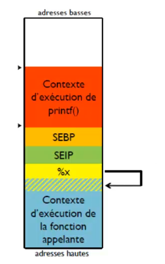
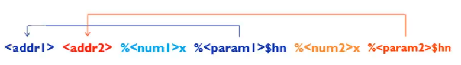
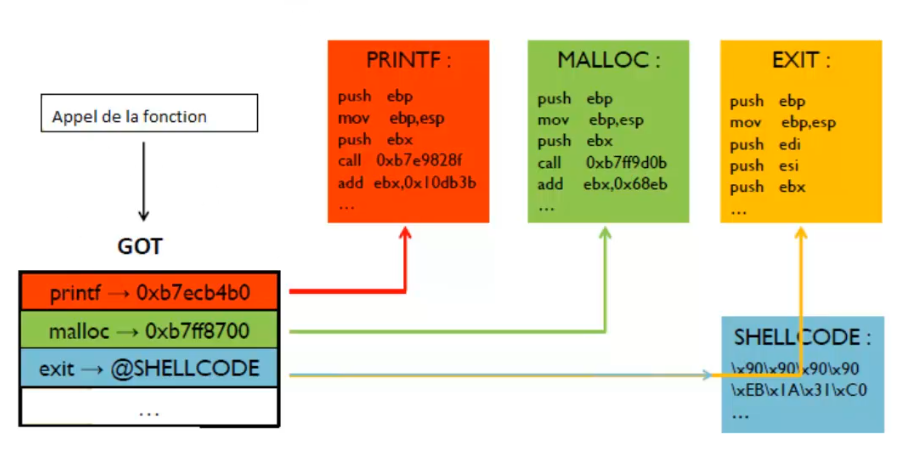

# formatString
Particular vulnerability to study

``` Variable functions and arguments must be secure```
```c
<type> function (<type>, ARG1);
```
Macros var_start, var_arg, var_end
</br>
<b>Example</b>
```c
printf()
printf(ARG1, ARG2...ARGN);
```

#### so what happens if we don't give the right number of arguments to printf()?



## The fault
using user input in a format string.
### Example
```c
printf(argv[1]);

printf("%s", argv[1]);
```
### useful formats for exploitation
* %x : hexadecimal display of a provided value
* %hn : writing the number of bytes processed by printf provided

## Solution
<hr>

* Direct parameter access > Specify the address to write to.
* Minimum size > writing a specific value.
* by forcing the formatting we prevent the hacker from wandering around and rewriting our stack.
## Exploit
<hr>

* shellcode injection
<p>looking for a function pointer after calling printf.</p>
<p>overwriting the pointer with the shellcode address.</p>
<p>once the function is overwritten, the program jumps to the shellcode address.</p>



## GOT - Global Offset Table
<hr>



<hr>

## The program
<hr>

```c
#include <stddef.h>
#include <stdio.h>
#include <stdlib.h>
#include <fcntl.h>
#define TAILLE_BUF 4 
void main (void)
{
    FILE* fic ;
    short int buffer[TAILLE_BUF]; /* this table stores the values ​​read in the file.*/
    short int i, nb_val_lues = TAILLE_BUF ;
    /* Opening the file (binary reading). : */
    fic = fopen( "texte.txt", "rb") ;
    if ( fic==NULL )
    {
        printf("Unable to open file !");
        exit(0);
    }
    /* Reading from file : */
    printf("\n List of values ​​read: \n");
    /*Filling the buffer and processing, as many times as necessary until the end of the file. : */
    while ( nb_val_lues == TAILLE_BUF ) /* vrai tant que fin du fichier non atteinte */
    {
        nb_val_lues = fread( buffer, sizeof(short int), TAILLE_BUF, fic);
        /* Processing the values ​​stored in the buffer (here, a simple display) : */
        for (i=0; i<nb_val_lues; i++) printf( "%hd", buffer[i] );
    }
    /* Closing the file : */
    fclose( fic ) ;
}
```
## Test
<hr>

* show file `texte.txt`
```terminal
cat texte.txt
``` 
output
```
%x%x%x%x%x%x%x%x%x%x%x%x%x%x%x

```

